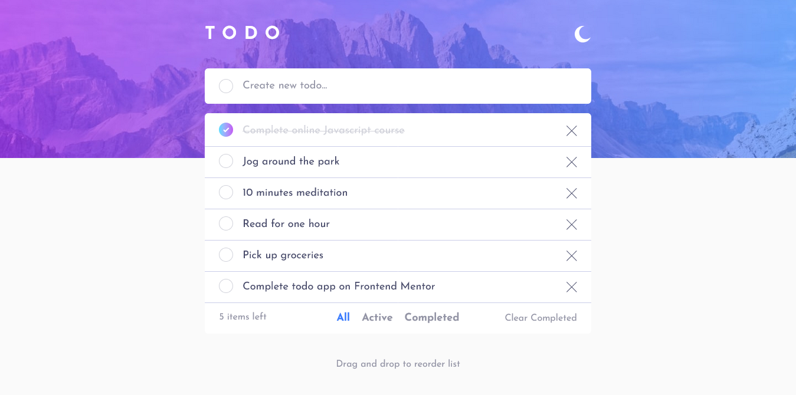

# Frontend Mentor - Todo app solution

This is a solution to the [Todo app challenge on Frontend Mentor](https://www.frontendmentor.io/challenges/todo-app-Su1_KokOW). Frontend Mentor challenges help you improve your coding skills by building realistic projects. 

## Table of contents

- [Overview](#overview)
  - [The challenge](#the-challenge)
  - [Screenshot](#screenshot)
  - [Links](#links)
  - [Built with](#built-with)
  - [What I learned](#what-i-learned)
  - [Continued development](#continued-development)
  - [Useful resources](#useful-resources)
- [Author](#author)

## Overview

### The challenge

Users should be able to:

- View the optimal layout for the app depending on their device's screen size
- See hover states for all interactive elements on the page
- Add new todos to the list
- Mark todos as complete
- Delete todos from the list
- Filter by all/active/complete todos
- Clear all completed todos
- Toggle light and dark mode
- **Bonus**: Drag and drop to reorder items on the list

### Screenshot

### Links

- Solution URL: [Add solution URL here](https://github.com/cassiopeia001/todo-app)
- Live Site URL: [Add live site URL here](https://cassiopeia001.github.io/todo-app/)

### Built with

- Semantic HTML5 markup
- Tailwind CSS
- Flexbox
- Grid 
- Mobile-first workflow
- Accessibility
- [React](https://reactjs.org/) - JS library
- [Dndkit] (https://dndkit.com/) -Drag and drop toolkit for React

### What I learned

- I learned how to use useMemo() from React for the first time which is a good way to optimize the app.
- I added accessibility to my project and kept it in mind throughout the development process.
- I learned how to use dnd kit for the first time and it is an effective and easy way to implement drag and drop while also making sure to keep the project accessible.

### Continued development

I would like to continue adding accessibility to my projects and improve in that area, and also learn more about how to add drag and drop functionality. In the next projects i would also like to use more React hooks as they can facilitate and optimize the app, and finally i wish to start adding backend to my projects.

### Useful resources

- [Create sortable drag and drop in React JS using dnd-kit library](https://medium.com/@kurniawanc/create-sortable-drag-and-drop-in-react-js-using-dnd-kit-library-ba8b2917a6b5) - This ressource helped me with working with dnd kit for the first time.

## Author

- Frontend Mentor - [@cassiopeia001](https://www.frontendmentor.io/profile/cassiopeia001)
